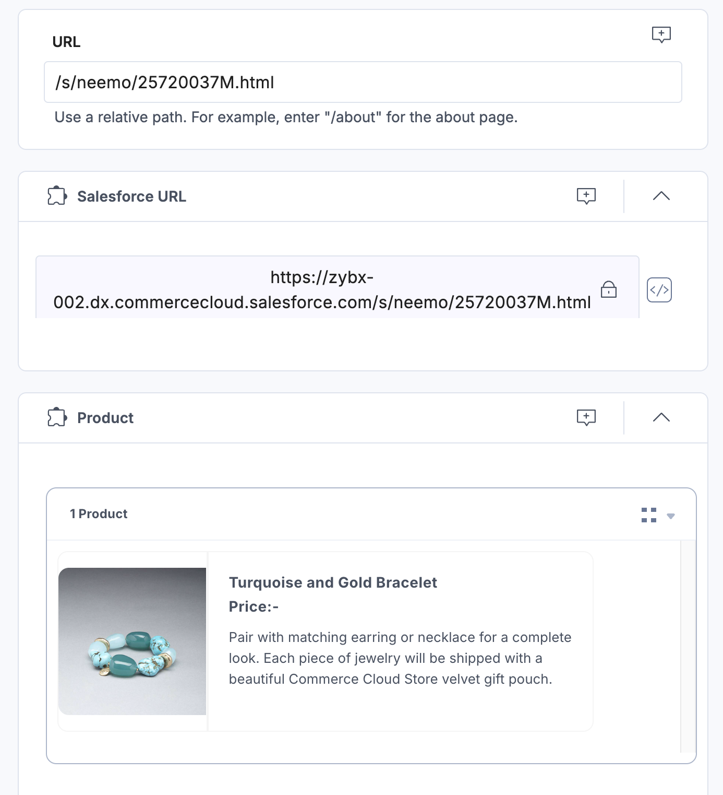
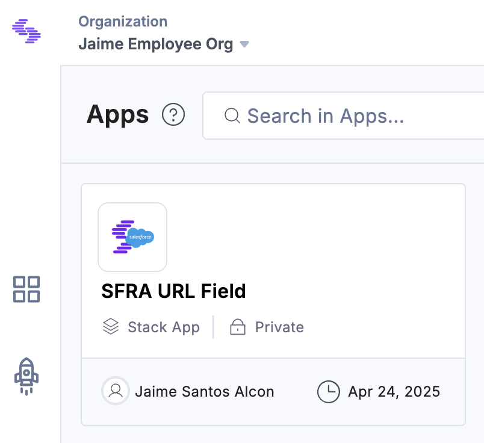
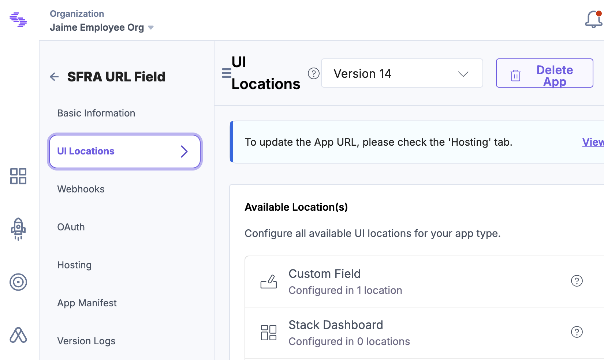

## SFRA Custom URL Field Extension

This component is a **Contentstack Custom Field Extension** built to generate and manage Salesforce Commerce Cloud (SFRA) product URLs dynamically based on product entry data.

### 📂 File: `SfraCustomUrlFieldExtension.tsx`

### 🔧 Purpose

This extension:

- Retrieves product data from the Contentstack entry.
- Derives the SFRA-relative product URL (e.g., `/products/product-name`).
- Displays the derived URL in a read-only field.
- Automatically updates both the custom field and a sibling `url` field with the generated path.
- Provides optional modals for debugging and config viewing.

---

### 🧩 Features

- **Dynamic URL Extraction**

  - Monitors changes to the `product` field.
  - Parses the product's `slugUrl` to extract a relative SFRA-friendly URL.
  - Defaults to `/s/neemo/product-id.html` if no valid product is found.

- **Dual Field Update**

  - Sets the value for both:
    - The custom field this extension is mounted on.
    - An additional `url` field in the same entry.

- **Custom Modals**

  - Opens a modal using `cbModal` to display product details using the product ID (`pid`).
  - Includes a secondary config modal that shows the current app configuration.

- **App SDK Integration**

  - Utilizes Contentstack’s App SDK to interact with entry data and environment.
  - Exposes `iframeRef` and `postRobot` to the `window` for debugging or communication.

- **UI Components**
  - Includes a read-only lock icon.
  - Conditionally renders modal trigger icons based on `pid`.
  - Displays the final derived URL within the UI.

---

### 📸 Screenshots

#### 🔗 Example Field Output

#### 🧩 App View in Contentstack

#### ⚙️ UI Locations Configuration

> 💡 Place these images under a folder like `/assets` in your project, and ensure the image paths match the folder structure in your repo.

---

### 🛠 Technologies Used

- React with TypeScript
- Contentstack App SDK (`@contentstack/venus-components`)
- Custom hooks: `useAppConfig`, `useAppSdk`
- CSS Modules for styling

---

### ⚠️ Disclaimer

> **This component is intended for development and demonstration purposes only.**  
> It is not optimized for production use and should be treated as a foundation or reference implementation for creating your own SFRA-compatible field extensions.
